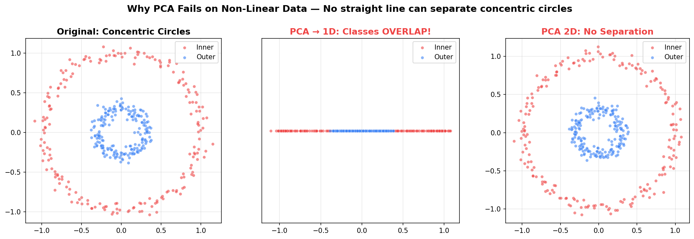
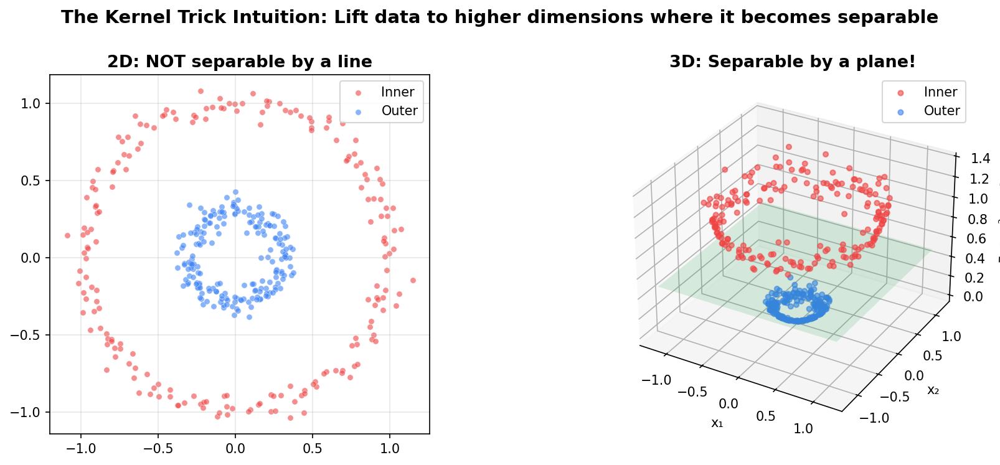
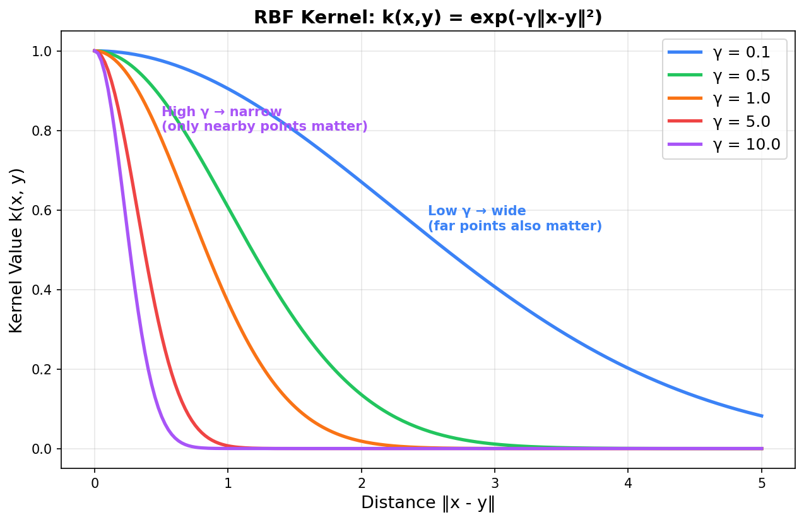
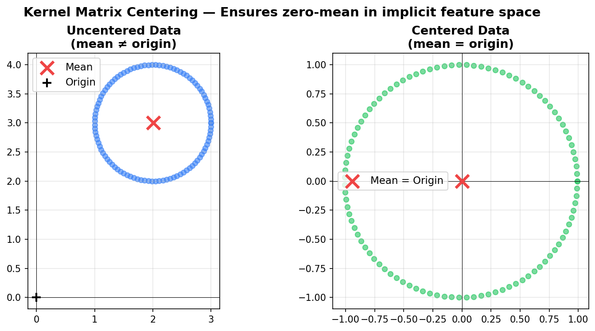
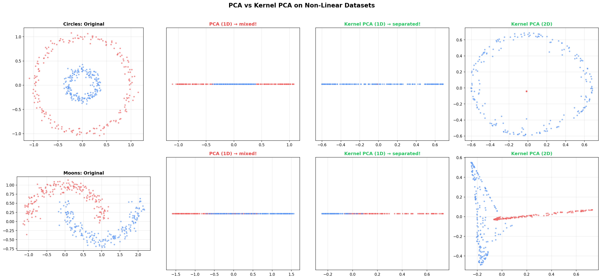
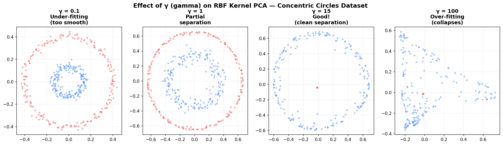
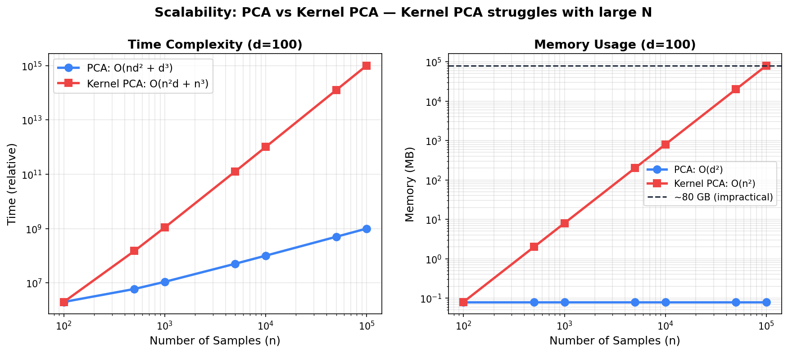

# Kernel PCA — When Linear PCA Fails

> **Core Idea:** Standard PCA assumes data varies along **straight lines**. When the structure is non-linear (like concentric circles), PCA fails completely. Kernel PCA uses the **kernel trick** to find non-linear principal components without explicitly working in high-dimensional space.

---

## Table of Contents

1. [The Problem — Why PCA Fails](#1-the-problem--why-pca-fails)
2. [The Intuition Behind Kernel PCA](#2-the-intuition-behind-kernel-pca)
3. [The Kernel Trick](#3-the-kernel-trick)
4. [Common Kernels](#4-common-kernels)
5. [Kernel PCA Algorithm](#5-kernel-pca-algorithm)
6. [Kernel PCA in scikit-learn](#6-kernel-pca-in-scikit-learn)
7. [Hyperparameter Tuning — Choosing Kernel & Parameters](#7-hyperparameter-tuning--choosing-kernel--parameters)
8. [PCA vs Kernel PCA — When to Use Which](#8-pca-vs-kernel-pca--when-to-use-which)
9. [Limitations & Practical Considerations](#9-limitations--practical-considerations)

---

## 1. The Problem — Why PCA Fails

PCA assumes principal components are **linear combinations** of original features. It finds straight axes of maximum variance.

This works when data has linear structure, but **not for non-linear patterns** like concentric circles — no straight line can separate them, and PCA's projection destroys the class structure.



> **Root cause:** PCA can only capture **linear** relationships. Concentric circles have a **radial** (non-linear) relationship.

---

## 2. The Intuition Behind Kernel PCA

### The Big Idea: Lift to Higher Dimensions

If data isn't linearly separable in its current space, **map it to a higher-dimensional space** where it becomes separable.



**Step by step:**

1. **Original 2D data:** Points at $(x_1, x_2)$
2. **Map to 3D:** Add feature $z = x_1^2 + x_2^2$ (distance from origin)
   - Inner circle → small $z$
   - Outer circle → large $z$
3. **In 3D:** A simple horizontal plane separates them
4. **Apply PCA in this new space** → First principal component separates classes

> This is exactly the same idea as in **SVM with kernels** — the kernel trick was borrowed from SVM into PCA.

---

## 3. The Kernel Trick

### The Problem with Explicit Mapping

Mapping to higher dimensions sounds great, but:
- What if you need to map to 1,000,000 dimensions?
- Computing $\Phi(x)$ for every data point is **extremely expensive**
- Storing the high-dimensional data is impractical

### The Solution: Never Compute $\Phi(x)$ Explicitly!

The kernel trick says: **you don't need the actual coordinates in high-dimensional space — you only need the dot products between points.**

$$
k(x, y) = \Phi(x)^T \Phi(y)
$$

A kernel function computes what the dot product **would be** in high-dimensional space, without ever going there.

**Without kernel trick:** $x \to \Phi(x) \to$ compute $\Phi(x)^T\Phi(y)$ in high-dim space → EXPENSIVE!

**With kernel trick:** $x, y \to k(x, y)$ directly → CHEAP! (one function call, stays in original dim)

### Mathematical Kernel Function

Instead of:
1. Map $x \to \Phi(x)$ (expensive)
2. Map $y \to \Phi(y)$ (expensive)
3. Compute $\Phi(x)^T \Phi(y)$ (expensive)

Just compute:

$$
k(x, y) = \text{some function of } x \text{ and } y
$$

This gives the **same answer** as steps 1-3, in a fraction of the time.

---

## 4. Common Kernels

| Kernel | Formula | Maps to | Best for |
|---|---|---|---|
| **Linear** | $k(x,y) = x^T y$ | Same space (no mapping) | Already linear data (= regular PCA) |
| **Polynomial** | $k(x,y) = (x^T y + c)^d$ | Finite higher-dim space | Polynomial-shaped boundaries |
| **RBF / Gaussian** | $k(x,y) = e^{-\frac{\lVert x-y \rVert^2}{2\sigma^2}}$ | **Infinite**-dim space | Most common, works on many shapes |
| **Sigmoid** | $k(x,y) = \tanh(\alpha \cdot x^T y + c)$ | Non-linear space | Neural network-like boundaries |

### RBF Kernel — The Most Important One

$$
k(x, y) = e^{-\frac{\lVert x - y \rVert^2}{2\sigma^2}}
$$

- Returns **1** when $x = y$ (identical points)
- Returns **~0** when points are far apart
- $\sigma$ controls the "width" — how far the influence reaches

> **Why RBF is powerful:** It implicitly maps to an **infinite-dimensional** space. It can capture virtually any non-linear pattern. The parameter $\sigma$ is the key hyperparameter to tune.

**Note:** sklearn uses `gamma` instead of $\sigma$, where $\gamma = \frac{1}{2\sigma^2}$:

$$
k(x, y) = e^{-\gamma \lVert x - y \rVert^2}
$$



- **High γ** → only very close points matter (complex boundaries)
- **Low γ** → distant points also matter (smooth boundaries)

### Cosine Kernel

$$
k(x, y) = \frac{x^T y}{\lVert x \rVert \lVert y \rVert}
$$

- Measures the **angle** between vectors (ignores magnitude)
- Commonly used for text data (TF-IDF vectors)
- Available in sklearn as `kernel='cosine'`

---

## 5. Kernel PCA Algorithm

### Standard PCA (for comparison)

1. Center data: $X \leftarrow X - \bar{X}$
2. Compute covariance: $\Sigma = \frac{1}{n}X^TX$
3. Eigendecompose: $\Sigma = V\Lambda V^T$
4. Project: $X_{\text{reduced}} = X V_k$

### Kernel PCA

1. Compute the **kernel matrix** $K$ where $K_{ij} = k(x_i, x_j)$ — this is an $N \times N$ matrix
2. **Center** the kernel matrix: $K' = K - \mathbf{1}_N K - K \mathbf{1}_N + \mathbf{1}_N K \mathbf{1}_N$
   - Where $\mathbf{1}_N$ is an $N \times N$ matrix with all entries $\frac{1}{N}$
3. **Eigendecompose** $K'$: solve $N\lambda \alpha = K' \alpha$
4. **Normalize** eigenvectors $\alpha^k$
5. **Project** new point: $\text{projection}_k = \sum_{i=1}^{N} \alpha_i^k \cdot k(x_i, x_{\text{new}})$

> **Key difference:** Regular PCA decomposes a $d \times d$ covariance matrix. Kernel PCA decomposes an $N \times N$ kernel matrix. This means Kernel PCA complexity scales with **number of samples**, not dimensions.

| | Standard PCA | Kernel PCA |
|---|---|---|
| **Input** | Data $X$ $(n \times d)$ | Data $X$ $(n \times d)$ |
| **Key matrix** | Covariance $\Sigma$ $(d \times d)$ | Kernel Matrix $K$ $(n \times n)$ |
| **Eigendecompose** | $\Sigma$ | $K$ |
| **Result** | Eigenvectors in feature space | Eigenvectors in kernel space |
| **Projection** | Via $V$ | Via kernel evaluations |

### Why Centering the Kernel Matrix Matters

In standard PCA we center the data ($X - \bar{X}$) before computing covariance. In Kernel PCA, we never have explicit $\Phi(x)$ coordinates, so we can't subtract the mean. Instead, we center **in kernel space** using the kernel matrix centering formula:

$$
K' = K - \mathbf{1}_N K - K \mathbf{1}_N + \mathbf{1}_N K \mathbf{1}_N
$$



> This centering step is handled automatically by sklearn's `KernelPCA`.

### Kernel PCA From Scratch

```python
import numpy as np

def rbf_kernel(X, gamma=1.0):
    """Compute RBF kernel matrix"""
    sq_dists = np.sum(X**2, axis=1).reshape(-1, 1) + \
               np.sum(X**2, axis=1).reshape(1, -1) - \
               2 * X @ X.T
    return np.exp(-gamma * sq_dists)

def kernel_pca_scratch(X, n_components=2, gamma=1.0):
    """Kernel PCA from scratch using RBF kernel"""
    N = X.shape[0]
    
    # 1. Compute kernel matrix
    K = rbf_kernel(X, gamma)
    
    # 2. Center the kernel matrix
    ones_N = np.ones((N, N)) / N
    K_centered = K - ones_N @ K - K @ ones_N + ones_N @ K @ ones_N
    
    # 3. Eigendecompose
    eigenvalues, eigenvectors = np.linalg.eigh(K_centered)
    
    # 4. Sort by descending eigenvalue
    idx = np.argsort(eigenvalues)[::-1]
    eigenvalues = eigenvalues[idx]
    eigenvectors = eigenvectors[:, idx]
    
    # 5. Normalize eigenvectors (divide by sqrt of eigenvalue)
    alphas = eigenvectors[:, :n_components]
    lambdas = eigenvalues[:n_components]
    alphas = alphas / np.sqrt(lambdas)
    
    # 6. Project
    X_reduced = K_centered @ alphas
    
    return X_reduced, eigenvalues[:n_components]
```

---

## 6. Kernel PCA in scikit-learn

### Basic Usage

```python
from sklearn.decomposition import KernelPCA
from sklearn.datasets import make_circles

# Generate concentric circles (non-linear data)
X, y = make_circles(n_samples=400, factor=0.3, noise=0.05, random_state=42)

# Apply Kernel PCA with RBF kernel
kpca = KernelPCA(n_components=2, kernel='rbf', gamma=15)
X_kpca = kpca.fit_transform(X)

# Compare with standard PCA
from sklearn.decomposition import PCA
pca = PCA(n_components=2)
X_pca = pca.fit_transform(X)
```

### Visualization: PCA vs Kernel PCA on Concentric Circles

```python
import matplotlib.pyplot as plt

fig, axes = plt.subplots(1, 3, figsize=(18, 5))

# Original data
axes[0].scatter(X[y==0, 0], X[y==0, 1], c='red', label='Inner', alpha=0.6)
axes[0].scatter(X[y==1, 0], X[y==1, 1], c='blue', label='Outer', alpha=0.6)
axes[0].set_title('Original Data (2D)')
axes[0].legend()

# Standard PCA
axes[1].scatter(X_pca[y==0, 0], X_pca[y==0, 1], c='red', label='Inner', alpha=0.6)
axes[1].scatter(X_pca[y==1, 0], X_pca[y==1, 1], c='blue', label='Outer', alpha=0.6)
axes[1].set_title('Standard PCA → FAILS')
axes[1].legend()

# Kernel PCA
axes[2].scatter(X_kpca[y==0, 0], X_kpca[y==0, 1], c='red', label='Inner', alpha=0.6)
axes[2].scatter(X_kpca[y==1, 0], X_kpca[y==1, 1], c='blue', label='Outer', alpha=0.6)
axes[2].set_title('Kernel PCA (RBF, γ=15) → SEPARATES!')
axes[2].legend()

plt.tight_layout()
plt.show()
```



> PCA projects both classes onto a line where they overlap (fails). Kernel PCA with RBF kernel separates them cleanly.

### sklearn KernelPCA Parameters

| Parameter | Description | Default | Notes |
|---|---|---|---|
| `n_components` | Number of components | `None` (all) | How many transformed features |
| `kernel` | Kernel function | `'linear'` | `'rbf'`, `'poly'`, `'sigmoid'`, `'cosine'`, `'precomputed'` |
| `gamma` | Kernel coefficient for RBF/poly/sigmoid | `None` ($\frac{1}{d}$) | **Critical for RBF.** Higher = more complex boundaries |
| `degree` | Degree for polynomial kernel | `3` | Only used with `kernel='poly'` |
| `coef0` | Independent term for poly/sigmoid | `1` | Offset in polynomial kernel |
| `fit_inverse_transform` | Learn the inverse mapping | `False` | Enables `inverse_transform()` (approximate) |
| `alpha` | Regularization for inverse transform | `1.0` | Ridge regularization for pre-image |
| `eigen_solver` | Solver for eigendecomposition | `'auto'` | `'auto'`, `'dense'`, `'arpack'`, `'randomized'` |
| `remove_zero_eig` | Remove zero eigenvalues | `False` | Set `True` to avoid numerical noise |

### Visualization: Effect of Gamma on RBF Kernel

```python
fig, axes = plt.subplots(1, 4, figsize=(20, 4))
gammas = [0.1, 1, 10, 100]

for ax, g in zip(axes, gammas):
    kpca = KernelPCA(n_components=2, kernel='rbf', gamma=g)
    X_t = kpca.fit_transform(X)
    ax.scatter(X_t[y==0, 0], X_t[y==0, 1], c='red', alpha=0.5, s=10)
    ax.scatter(X_t[y==1, 0], X_t[y==1, 1], c='blue', alpha=0.5, s=10)
    ax.set_title(f'γ = {g}')

plt.suptitle('Effect of γ on RBF Kernel PCA', fontsize=14)
plt.tight_layout()
plt.show()
```



> **Key insight:** Low γ → under-fitting (almost linear), high γ → over-fitting (everything collapses). The sweet spot separates clusters cleanly.

### Using Different Kernels

```python
from sklearn.datasets import make_moons

X, y = make_moons(n_samples=200, noise=0.1, random_state=42)

fig, axes = plt.subplots(1, 4, figsize=(20, 4))
kernels = ['linear', 'poly', 'rbf', 'cosine']

for ax, kern in zip(axes, kernels):
    params = {'n_components': 2, 'kernel': kern}
    if kern == 'rbf':
        params['gamma'] = 15
    elif kern == 'poly':
        params['degree'] = 3
    
    kpca = KernelPCA(**params)
    X_t = kpca.fit_transform(X)
    ax.scatter(X_t[y==0, 0], X_t[y==0, 1], c='red', alpha=0.6)
    ax.scatter(X_t[y==1, 0], X_t[y==1, 1], c='blue', alpha=0.6)
    ax.set_title(f'kernel={kern}')

plt.suptitle('Kernel PCA with Different Kernels (moons dataset)', fontsize=14)
plt.tight_layout()
plt.show()
```

### Inverse Transform (Pre-Image Problem)

```python
# Enable inverse transform (approximate reconstruction)
kpca = KernelPCA(
    n_components=2,
    kernel='rbf',
    gamma=15,
    fit_inverse_transform=True,   # ← enables approximate inverse
    alpha=0.1                     # ← regularization for inverse
)

X_kpca = kpca.fit_transform(X)
X_reconstructed = kpca.inverse_transform(X_kpca)

# Reconstruction error
reconstruction_error = np.mean(np.sum((X - X_reconstructed) ** 2, axis=1))
print(f"Mean reconstruction error: {reconstruction_error:.4f}")
```

> **Important:** Unlike standard PCA where the inverse transform is exact, Kernel PCA's inverse requires solving the **pre-image problem** — finding a point in input space whose image in kernel space matches the projection. This is always an approximation.

---

## 7. Hyperparameter Tuning — Choosing Kernel & Parameters

### Strategy 1: Grid Search with Downstream Task

The best way to tune Kernel PCA is to evaluate it on a **downstream task** (e.g., classification accuracy):

```python
from sklearn.model_selection import GridSearchCV
from sklearn.pipeline import Pipeline
from sklearn.svm import SVC

# Create pipeline: Kernel PCA → SVM classifier
pipe = Pipeline([
    ('kpca', KernelPCA(n_components=2)),
    ('clf', SVC(kernel='linear'))
])

# Grid search over kernel and gamma
param_grid = {
    'kpca__kernel': ['rbf', 'poly', 'sigmoid'],
    'kpca__gamma': np.linspace(0.01, 50, 20),
}

grid = GridSearchCV(pipe, param_grid, cv=5, scoring='accuracy')
grid.fit(X, y)

print(f"Best params: {grid.best_params_}")
print(f"Best accuracy: {grid.best_score_:.4f}")
```

### Strategy 2: Reconstruction Error

If there's no downstream task, minimize the **reconstruction error**:

```python
from sklearn.model_selection import GridSearchCV

kpca = KernelPCA(
    n_components=2,
    fit_inverse_transform=True
)

param_grid = {
    'kernel': ['rbf', 'poly'],
    'gamma': np.logspace(-2, 2, 20)
}

# Custom scoring: negative reconstruction error
def reconstruction_score(estimator, X):
    X_reduced = estimator.transform(X)
    X_reconstructed = estimator.inverse_transform(X_reduced)
    return -np.mean(np.sum((X - X_reconstructed) ** 2, axis=1))

grid = GridSearchCV(kpca, param_grid, cv=3, scoring=reconstruction_score)
grid.fit(X)
print(f"Best: {grid.best_params_}")
```

### Kernel Selection Guide

> **Kernel selection rule of thumb:**
> - **Known polynomial relationship?** → `kernel='poly'`, set `degree=2,3,...`
> - **Unknown / complex structure?** → `kernel='rbf'` (default choice), tune `gamma`
> - **Polynomial not working?** → Try `'rbf'` anyway — it's the most flexible kernel

| Data Pattern | Recommended Kernel | Key Parameter |
|---|---|---|
| **Linear** (sanity check) | `'linear'` | None (equivalent to standard PCA) |
| **Concentric circles, moons** | `'rbf'` | `gamma` (higher = more complex) |
| **Polynomial boundaries** | `'poly'` | `degree` (2=quadratic, 3=cubic) |
| **Unknown** | `'rbf'` | Start with `gamma=1/n_features`, tune from there |

---

## 8. PCA vs Kernel PCA — When to Use Which

| Criterion | Standard PCA | Kernel PCA |
|---|---|---|
| **Data structure** | Linear | **Non-linear** |
| **Computes** | Covariance matrix eigen decomposition (or SVD) | Kernel matrix eigen decomposition |
| **Matrix size** | $d \times d$ (features) | $N \times N$ (samples) |
| **Scalability** | Scales with features | Scales with **samples** (expensive for large $N$) |
| **Inverse transform** | Exact | Approximate (pre-image problem) |
| **Hyperparameters** | None | Kernel choice + kernel parameters ($\sigma$, degree, etc.) |
| **Interpretability** | High (components are linear combos) | Low (components in implicit high-dim space) |
| **Sklearn class** | `PCA` (uses SVD internally) | `KernelPCA` |
| **Memory** | $O(d^2)$ or $O(nd)$ | $O(N^2)$ — stores full kernel matrix |
| **Time complexity** | $O(nd^2)$ or $O(nd \cdot k)$ randomized | $O(N^2 d + N^3)$ |

### Decision Flowchart

> **Decision guide:**
> 1. **Data is linearly structured?** → Use standard PCA
> 2. **Non-linear + manageable N (< ~10,000)?** → Use Kernel PCA
> 3. **Non-linear + large N?** → Consider Nystroem approximation, Random Fourier Features, t-SNE/UMAP (visualization), or Autoencoders (reconstruction)

### Complete Comparison Pipeline

```python
import numpy as np
import matplotlib.pyplot as plt
from sklearn.decomposition import PCA, KernelPCA
from sklearn.datasets import make_circles, make_moons

# Dataset 1: Concentric circles
X_circles, y_circles = make_circles(n_samples=400, factor=0.3, noise=0.05, random_state=42)

# Dataset 2: Moons
X_moons, y_moons = make_moons(n_samples=400, noise=0.1, random_state=42)

fig, axes = plt.subplots(2, 4, figsize=(22, 10))

for row, (X, y, name) in enumerate([(X_circles, y_circles, 'Circles'),
                                      (X_moons, y_moons, 'Moons')]):
    # Original
    axes[row, 0].scatter(X[y==0, 0], X[y==0, 1], c='red', s=10, alpha=0.6)
    axes[row, 0].scatter(X[y==1, 0], X[y==1, 1], c='blue', s=10, alpha=0.6)
    axes[row, 0].set_title(f'{name}: Original')
    
    # Standard PCA
    X_pca = PCA(n_components=1).fit_transform(X)
    axes[row, 1].scatter(X_pca[y==0], np.zeros_like(X_pca[y==0]), c='red', s=10, alpha=0.6)
    axes[row, 1].scatter(X_pca[y==1], np.zeros_like(X_pca[y==1]), c='blue', s=10, alpha=0.6)
    axes[row, 1].set_title(f'{name}: PCA (1D) → mixed!')
    
    # Kernel PCA (RBF)
    X_kpca = KernelPCA(n_components=1, kernel='rbf', gamma=15).fit_transform(X)
    axes[row, 2].scatter(X_kpca[y==0], np.zeros_like(X_kpca[y==0]), c='red', s=10, alpha=0.6)
    axes[row, 2].scatter(X_kpca[y==1], np.zeros_like(X_kpca[y==1]), c='blue', s=10, alpha=0.6)
    axes[row, 2].set_title(f'{name}: Kernel PCA (1D) → separated!')
    
    # Kernel PCA (2D)
    X_kpca2 = KernelPCA(n_components=2, kernel='rbf', gamma=15).fit_transform(X)
    axes[row, 3].scatter(X_kpca2[y==0, 0], X_kpca2[y==0, 1], c='red', s=10, alpha=0.6)
    axes[row, 3].scatter(X_kpca2[y==1, 0], X_kpca2[y==1, 1], c='blue', s=10, alpha=0.6)
    axes[row, 3].set_title(f'{name}: Kernel PCA (2D)')

plt.suptitle('PCA vs Kernel PCA on Non-Linear Data', fontsize=16)
plt.tight_layout()
plt.show()
```

### Nystroem Approximation — Scaling Kernel PCA

When $N$ is too large for a full $N \times N$ kernel matrix, use sklearn's `Nystroem` approximation:

```python
from sklearn.kernel_approximation import Nystroem

# Approximate the kernel map with a subset of samples
nystroem = Nystroem(kernel='rbf', gamma=15, n_components=100, random_state=42)
X_approx = nystroem.fit_transform(X)  # (n, 100) approximate kernel features

# Then apply standard PCA on the approximate features
from sklearn.decomposition import PCA
pca = PCA(n_components=2)
X_reduced = pca.fit_transform(X_approx)
# Approximates Kernel PCA but scales to large N!
```

### Related Kernel Methods

The kernel trick isn't unique to PCA — it's a general technique:

| Method | Linear Version | Kernel Version | sklearn Class |
|---|---|---|---|
| PCA | Standard PCA | Kernel PCA | `KernelPCA` |
| SVM | Linear SVM | Kernel SVM | `SVC(kernel='rbf')` |
| Ridge Regression | Linear Ridge | Kernel Ridge | `KernelRidge` |
| Fisher Discriminant | LDA | Kernel FDA | — |
| k-Means | k-Means | Spectral Clustering | `SpectralClustering` |

---

## 9. Limitations & Practical Considerations

### Computational Cost



> **Example:** For 100,000 samples, the kernel matrix has $100{,}000^2 = 10^{10}$ entries × 8 bytes each ≈ **80 GB RAM** — impractical without approximation methods.

### When Kernel PCA Struggles

| Issue | Explanation | Workaround |
|---|---|---|
| **Large $N$** | $O(N^3)$ computation, $O(N^2)$ memory | Nystroem approximation, Random Fourier Features |
| **Hyperparameter sensitivity** | Wrong `gamma` → useless results | Grid search with cross-validation |
| **No inverse transform** | Pre-image problem is ill-posed | `fit_inverse_transform=True` (approximate) |
| **No explained variance ratio** | Eigenvalues don't directly map to variance in input space | Use `lambdas_` attribute for relative comparison |
| **Interpretability** | Components live in implicit infinite-dim space | Hard to explain to stakeholders |

### Alternatives to Kernel PCA

| Method | Strengths | Best For |
|---|---|---|
| **t-SNE** | Excellent for visualization, preserves local structure | 2D/3D visualization |
| **UMAP** | Faster than t-SNE, preserves global structure better | Visualization + clustering |
| **Autoencoders** | Learnable non-linear encoding, scalable | Large datasets, deep non-linear manifolds |
| **Isomap** | Preserves geodesic distances on manifold | Data lying on a smooth manifold |
| **LLE** | Preserves local linear structure | Unrolling manifolds |

> **Scalability vs Interpretability trade-off:** Kernel PCA sits in the middle ground — principled mathematical foundation with moderate scalability. Autoencoders and UMAP scale better; LLE/Isomap have stronger theoretical guarantees but scale worse.

---

> **Prerequisites:** [Linear Algebra for PCA](references/linear-algebra-for-pca.md) (special matrices, eigen decomposition) → [PCA Theory](02-pca.ipynb) → this note.
>
> **Related:** [SVD](05-svd.md) — the matrix decomposition that powers standard PCA under the hood.
>
> **Next steps:** Implement Kernel PCA from scratch using scikit-learn's `KernelPCA` class, or explore [SVD](05-svd.md) for understanding how sklearn's PCA actually works internally.
