# Singular Value Decomposition (SVD) — The Universal Matrix Factorization

> **Core Idea:** SVD decomposes **any** matrix (any shape, any rank) into three simple matrices: a rotation, a scaling, and another rotation. It's the most general and powerful matrix decomposition, and the mathematical backbone of PCA, recommender systems, image compression, and NLP.

---

## Table of Contents

1. [Why SVD? — Motivation](#1-why-svd--motivation)
2. [The SVD Formula](#2-the-svd-formula)
3. [Geometric Intuition — Rotate, Scale, Rotate](#3-geometric-intuition--rotate-scale-rotate)
4. [Full SVD vs Reduced (Truncated) SVD](#4-full-svd-vs-reduced-truncated-svd)
5. [How to Compute SVD — Step by Step](#5-how-to-compute-svd--step-by-step)
6. [SVD and PCA — The Deep Connection](#6-svd-and-pca--the-deep-connection)
7. [Applications of SVD](#7-applications-of-svd)
8. [SVD in scikit-learn & NumPy](#8-svd-in-scikit-learn--numpy)
9. [SVD vs Eigen Decomposition — When to Use Which](#9-svd-vs-eigen-decomposition--when-to-use-which)
10. [Key Properties & Theorems](#10-key-properties--theorems)

---

## 1. Why SVD? — Motivation

### The Limitation of Eigen Decomposition

Eigen decomposition requires a **square** matrix and only works when the matrix is **diagonalizable**:

$$
A = V\Lambda V^{-1} \quad \text{(only for square, diagonalizable matrices)}
$$

But in ML, our data matrix $X$ is almost never square — it's $n \times d$ (samples × features) — **can't do eigen decomposition on $X$ directly!**

### Matrix Transformation Visualization

A matrix $A$ of size $m \times n$ maps objects from $n$-dimensional space to $m$-dimensional space:

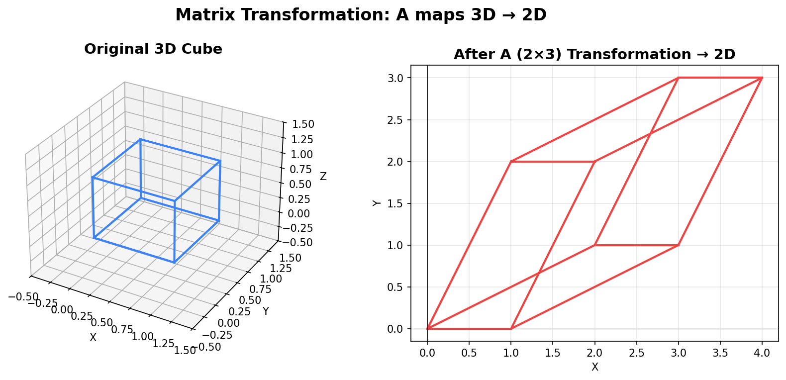

### SVD to the Rescue

SVD works on **any** matrix — square or rectangular, any rank, any size:

$$
\boxed{A_{m \times n} = U_{m \times m} \cdot \Sigma_{m \times n} \cdot V^T_{n \times n}}
$$

> **SVD always exists.** There is no matrix for which SVD cannot be computed. This is the **Existence Theorem of SVD**.

---

## 2. The SVD Formula

### The Decomposition

Any real matrix $A$ of size $m \times n$ can be factorized as:

$$
\boxed{A = U \Sigma V^T}
$$

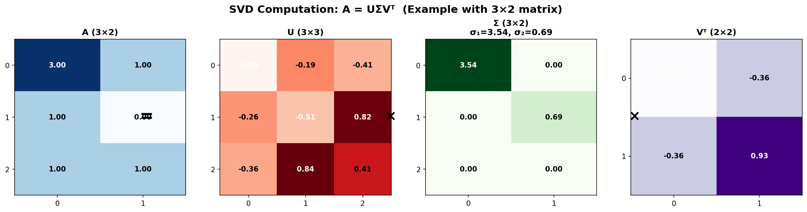

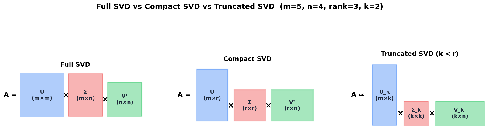

### Components Explained

| Component | Name | Size | Properties |
|---|---|---|---|
| $U$ | **Left singular vectors** | $m \times m$ | Orthogonal ($U^TU = I$). Columns = orthonormal basis for column space |
| $\Sigma$ | **Singular value matrix** | $m \times n$ | Diagonal-like with $\sigma_1 \geq \sigma_2 \geq \cdots \geq \sigma_r > 0$ on the diagonal |
| $V^T$ | **Right singular vectors** (transposed) | $n \times n$ | Orthogonal ($V^TV = I$). Rows = orthonormal basis for row space |

### Singular Values

The diagonal entries $\sigma_1 \geq \sigma_2 \geq \cdots \geq \sigma_r$ where $r = \text{rank}(A)$ are the **singular values**.

- Always **real and non-negative** ($\sigma_i \geq 0$)
- Ordered from largest to smallest
- Number of non-zero singular values = **rank** of the matrix
- They represent the "importance" or "strength" of each component

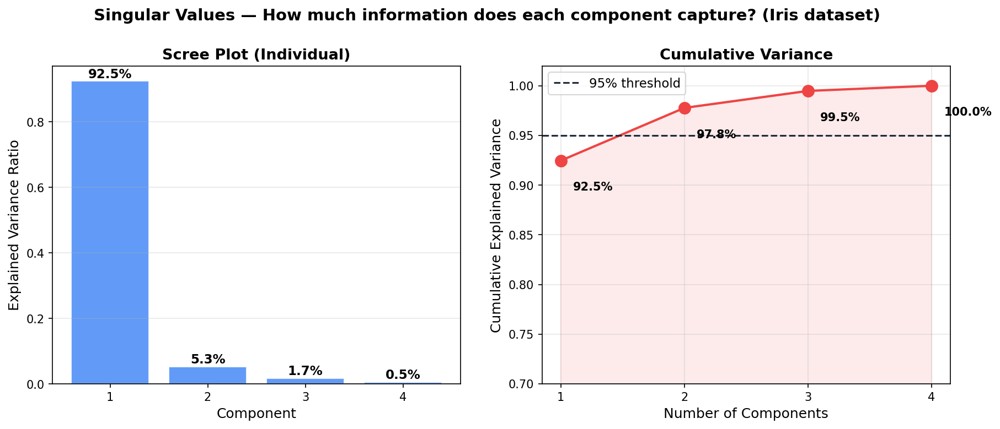

> The rapid drop-off in singular values is what makes truncation/compression possible!

---

## 3. Geometric Intuition — Rotate, Scale, Rotate

SVD says: **every linear transformation is a rotation, followed by a scaling, followed by another rotation.**

$$
A\vec{x} = U \cdot \Sigma \cdot V^T \cdot \vec{x}
$$

Reading **right to left**:

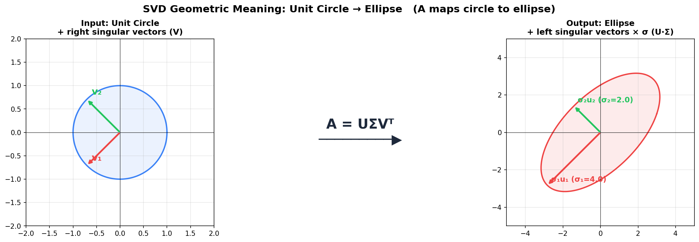

| Step | Matrix | Operation | Geometric Effect |
|---|---|---|---|
| 1 | $V^T$ | Rotation in **input space** | Aligns data with canonical axes |
| 2 | $\Sigma$ | Scaling | Stretches/compresses along each axis by $\sigma_i$ |
| 3 | $U$ | Rotation in **output space** | Rotates the scaled result to final orientation |

### The Unit Circle → Ellipse Visualization

This is the most important visual for understanding SVD. Any matrix maps the unit circle to an ellipse:

> **Key insight:** The right singular vectors $V$ define the **input directions**, the left singular vectors $U$ define the **output directions**, and the singular values $\sigma_i$ define the **stretching factors** along each direction.

### SVD Decomposes a Cube: Step-by-Step Geometric Demo

Here we apply SVD to a 3D transformation matrix and visualize each step on a cube:

**Step 1: Vᵀ Rotation — Align with principal axes**

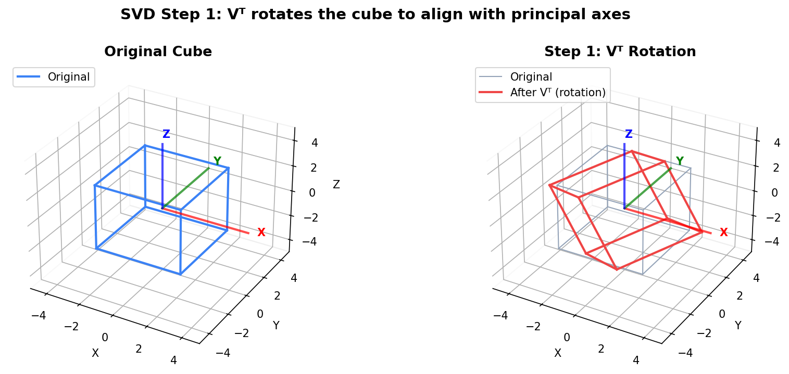

**Step 2: Projection to lower dimension**

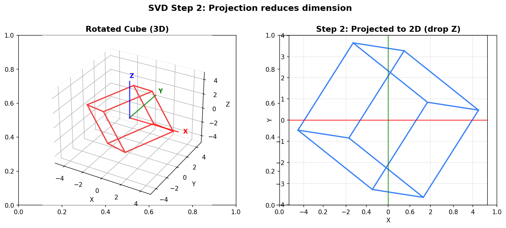

**Step 3: Σ Scaling — Stretch by singular values**

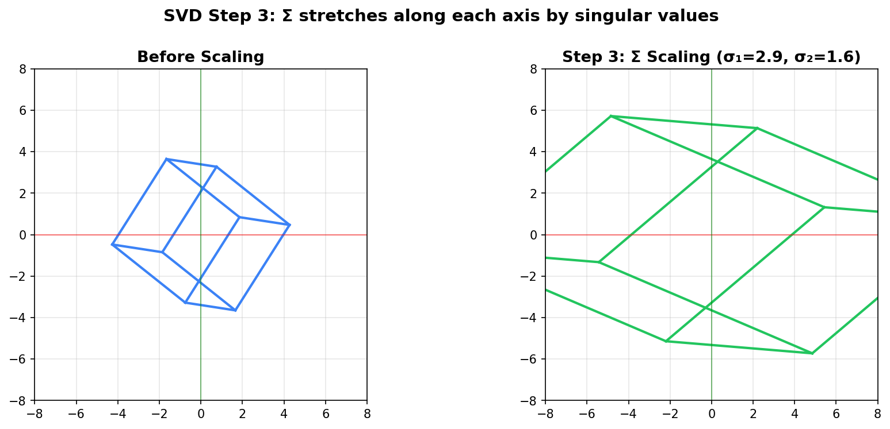

**Step 4: U Rotation — Final output orientation**

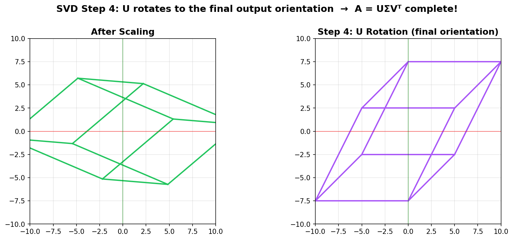

The complete transformation A is the composition of all four steps: **A = U · Σ · Vᵀ**

### Unit Square through SVD Steps (2D)

The same concept shown with a 2D unit square — rotate, scale, then embed and rotate in 3D:

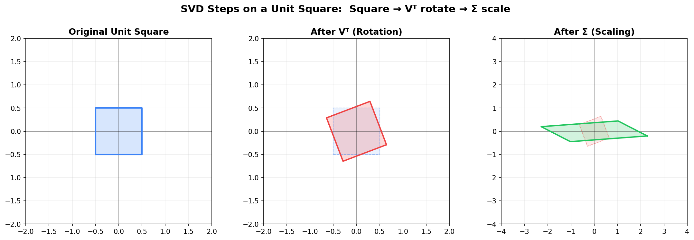

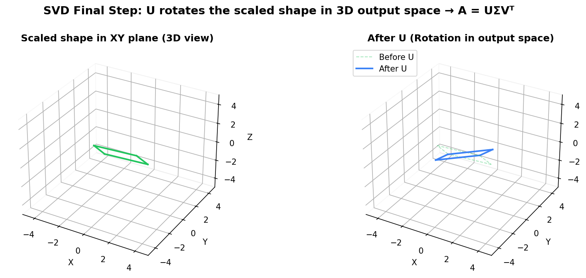

---

## 4. Full SVD vs Reduced (Truncated) SVD

### Full SVD

$$
A_{m \times n} = U_{m \times m} \cdot \Sigma_{m \times n} \cdot V^T_{n \times n}
$$

All matrices are at their full dimensions. Many columns of $U$ and $V$ may correspond to zero singular values.

### Compact (Economy) SVD

Only keep the $r$ columns corresponding to non-zero singular values ($r = \text{rank}(A)$):

$$
A_{m \times n} = U_{m \times r} \cdot \Sigma_{r \times r} \cdot V^T_{r \times n}
$$


### Truncated SVD (the key for dimensionality reduction!)

Keep only the top $k$ singular values (where $k < r$):

$$
\boxed{A \approx A_k = U_k \cdot \Sigma_k \cdot V_k^T}
$$

**Full:** $A = \sigma_1 u_1 v_1^T + \sigma_2 u_2 v_2^T + \cdots + \sigma_r u_r v_r^T$

**Truncated:** $A \approx \sigma_1 u_1 v_1^T + \sigma_2 u_2 v_2^T + \cdots + \sigma_k u_k v_k^T \quad (k < r)$ ← **Best rank-k approximation!**

> **Eckart–Young–Mirsky Theorem:** The truncated SVD $A_k$ is the **best rank-k approximation** of $A$, minimizing $\lVert A - A_k \rVert$ in both Frobenius and spectral norms. No other rank-$k$ matrix is closer to $A$.

### Comparison Table

| Type | Formula | Size of $U$ | Size of $\Sigma$ | Size of $V$ | Use Case |
|---|---|---|---|---|---|
| **Full** | $A = U\Sigma V^T$ | $m \times m$ | $m \times n$ | $n \times n$ | Theoretical / exact |
| **Compact** | $A = U_r\Sigma_r V_r^T$ | $m \times r$ | $r \times r$ | $n \times r$ | Exact, less memory |
| **Truncated** | $A \approx U_k\Sigma_k V_k^T$ | $m \times k$ | $k \times k$ | $n \times k$ | **Dimensionality reduction, compression** |

### How Much Information Is Retained?

The fraction of total "information" (variance) retained by keeping $k$ singular values:

$$
\text{Explained Variance Ratio} = \frac{\sum_{i=1}^{k} \sigma_i^2}{\sum_{i=1}^{r} \sigma_i^2}
$$


The **elbow** in the scree plot tells you how many components to keep. In the example above, 2 components capture ~97.8% of variance.

---

## 5. How to Compute SVD — Step by Step

### Relationship to Eigendecomposition

SVD is deeply connected to eigendecomposition via two key matrices:

$$
A^T A = V \Sigma^T U^T \cdot U \Sigma V^T = V (\Sigma^T \Sigma) V^T
$$

$$
A A^T = U \Sigma V^T \cdot V \Sigma^T U^T = U (\Sigma \Sigma^T) U^T
$$

**Key relationship:**
- $A^TA$ is $n\times n$ symmetric → eigendecompose → gives $V$ and $\sigma_i^2$
- $AA^T$ is $m\times m$ symmetric → eigendecompose → gives $U$ and $\sigma_i^2$
- $\sigma_i = \sqrt{\text{eigenvalue of } A^TA} = \sqrt{\text{eigenvalue of } AA^T}$

### Step-by-Step Algorithm

Given $A$ ($m \times n$):

1. **Compute** $A^T A$ (size $n \times n$, symmetric positive semi-definite)

2. **Eigendecompose** $A^T A$:
   - Eigenvalues: $\lambda_1 \geq \lambda_2 \geq \cdots \geq \lambda_n \geq 0$
   - Eigenvectors: $v_1, v_2, \ldots, v_n$ → form $V$

3. **Compute singular values**: $\sigma_i = \sqrt{\lambda_i}$
   → Form $\Sigma$ as the diagonal matrix of $\sigma_i$'s

4. **Compute left singular vectors**: $u_i = \frac{A v_i}{\sigma_i}$ for each $\sigma_i > 0$
   → Form $U$


### Worked Example

$$
A = \begin{bmatrix} 3 & 2 \\ 2 & 3 \\ 2 & -2 \end{bmatrix}
$$

**Step 1:** $A^T A = \begin{bmatrix} 3&2&2 \\ 2&3&-2 \end{bmatrix}\begin{bmatrix} 3&2 \\ 2&3 \\ 2&-2 \end{bmatrix} = \begin{bmatrix} 17 & 8 \\ 8 & 17 \end{bmatrix}$

**Step 2:** Eigenvalues of $A^T A$:

$\det(A^T A - \lambda I) = (17-\lambda)^2 - 64 = 0$

$\lambda_1 = 25, \quad \lambda_2 = 9$

Eigenvectors: $v_1 = \frac{1}{\sqrt{2}}\begin{bmatrix}1\\1\end{bmatrix}, \quad v_2 = \frac{1}{\sqrt{2}}\begin{bmatrix}1\\-1\end{bmatrix}$

**Step 3:** Singular values: $\sigma_1 = 5, \quad \sigma_2 = 3$

**Step 4:** Left singular vectors:

$u_1 = \frac{Av_1}{5} = \frac{1}{5\sqrt{2}}\begin{bmatrix}5\\5\\0\end{bmatrix} = \frac{1}{\sqrt{2}}\begin{bmatrix}1\\1\\0\end{bmatrix}$

$u_2 = \frac{Av_2}{3} = \frac{1}{3\sqrt{2}}\begin{bmatrix}1\\-1\\4\end{bmatrix} = \frac{1}{3\sqrt{2}}\begin{bmatrix}1\\-1\\4\end{bmatrix}$

$$
A = \underbrace{\begin{bmatrix} \frac{1}{\sqrt{2}} & \frac{1}{3\sqrt{2}} \\ \frac{1}{\sqrt{2}} & \frac{-1}{3\sqrt{2}} \\ 0 & \frac{4}{3\sqrt{2}} \end{bmatrix}}_{U} \underbrace{\begin{bmatrix} 5 & 0 \\ 0 & 3 \end{bmatrix}}_{\Sigma} \underbrace{\begin{bmatrix} \frac{1}{\sqrt{2}} & \frac{1}{\sqrt{2}} \\ \frac{1}{\sqrt{2}} & \frac{-1}{\sqrt{2}} \end{bmatrix}}_{V^T}
$$

---

## 6. SVD and PCA — The Deep Connection

### The Two Paths to PCA

PCA can be computed in two equivalent ways:

**Path 1: Eigen Decomposition** — Center X → Covariance $\Sigma = X^TX/(n-1)$ → Eigendecompose $\Sigma = V\Lambda V^T$ → $V$ = PC directions, $\Lambda$ = variances

**Path 2: SVD** — Center X → $X = U\Sigma V^T$ (SVD directly on X) → $V$ = right singular vectors (same V!), $\Lambda = \Sigma^2/(n-1)$

Both paths produce the same result: $X_{\text{reduced}} = X \cdot V_k$

### Why They Give the Same Result

The covariance matrix is:

$$
C = \frac{X^T X}{n-1}
$$

If $X = U\Sigma V^T$, then:

$$
C = \frac{(U\Sigma V^T)^T (U\Sigma V^T)}{n-1} = \frac{V\Sigma^T U^T U\Sigma V^T}{n-1} = V \cdot \frac{\Sigma^2}{n-1} \cdot V^T
$$

Comparing with eigen decomposition $C = V\Lambda V^T$:

$$
\boxed{\lambda_i = \frac{\sigma_i^2}{n-1}}
$$

> **The principal component directions $V$ from PCA are exactly the right singular vectors from SVD!** The eigenvalues (variances) are the squared singular values divided by $(n-1)$.

### Why sklearn Uses SVD Instead of Eigen Decomposition

| | Eigen Decomposition Path | SVD Path (what sklearn does) |
|---|---|---|
| **Steps** | Center X → Compute $C = X^TX/(n-1)$ $O(nd^2)$ → Eigendecompose $C$ $O(d^3)$ | Center X → SVD of X directly → $V$, $\sigma$ already found |
| **Stability** | $X^TX$ computation loses precision (squaring amplifies rounding errors) | More numerically stable, no need to form $X^TX$ |
| **Efficiency** | Unstable for ill-conditioned data | Efficient randomized algorithms exist |

> **sklearn's `PCA` class internally uses SVD (via `scipy.linalg.svd` or randomized SVD), NOT eigen decomposition.** This is a deliberate design choice for numerical stability.

---

## 7. Applications of SVD

### 7.1 Image Compression

An image is a matrix of pixel values. Using truncated SVD:

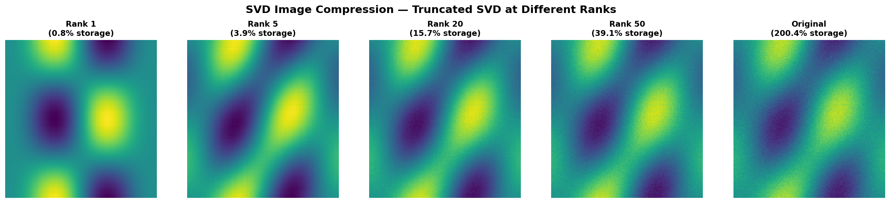

$$
A_{\text{image}} \approx \sum_{i=1}^{k} \sigma_i \cdot u_i \cdot v_i^T
$$

Each rank-1 matrix $\sigma_i u_i v_i^T$ adds a layer of detail. The first few capture the overall structure; later ones add fine details and noise. A rank-50 approximation of a 1000×1000 image uses only ~10% of the original storage while remaining visually similar.

### 7.2 Recommender Systems (Netflix / Collaborative Filtering)

SVD decomposes a sparse User-Movie rating matrix into:
- $U$ = user preferences (latent factors: "likes action", "likes drama"...)
- $\Sigma$ = strength of each latent factor
- $V^T$ = movie characteristics (latent factors)

Missing ratings $\approx U_k \cdot \Sigma_k \cdot V_k^T$ — this fills in the unknown ratings.

### 7.3 Latent Semantic Analysis (NLP)

SVD applied to a Term-Document matrix discovers **latent topics**:
- Topic 1 ($\sigma_1$): "ML topic" (machine + learning)
- Topic 2 ($\sigma_2$): "DL topic" (neural + network)

Documents and terms get mapped to the same low-dimensional "topic space", enabling semantic similarity search even when exact words don't match.

### 7.4 Noise Reduction / Denoising

In a noisy signal, large singular values correspond to the real signal while small singular values correspond to noise. By keeping only the top-$k$ singular values (truncated SVD), we remove the noise components while preserving the signal structure.

### 7.5 Pseudoinverse (Moore-Penrose)

For non-square or singular matrices, the inverse doesn't exist. SVD provides the **pseudoinverse**:

$$
A^+ = V \Sigma^+ U^T
$$

Where $\Sigma^+$ is formed by taking the reciprocal of each non-zero singular value.

This is used in:
- **Least squares** regression ($\hat{x} = A^+ b$)
- **Underdetermined / overdetermined systems**
- sklearn's `LinearRegression` under the hood

---

## 8. SVD in scikit-learn & NumPy

### NumPy: Full SVD

```python
import numpy as np

# Create a data matrix
X = np.array([[3, 2],
              [2, 3],
              [2, -2]])

# Full SVD
U, s, Vt = np.linalg.svd(X, full_matrices=True)

print(f"U shape:  {U.shape}")    # (3, 3)
print(f"s (singular values): {s}")  # [5. 3.]
print(f"Vt shape: {Vt.shape}")  # (2, 2)

# Reconstruct: need to build Sigma matrix from s
Sigma = np.zeros_like(X, dtype=float)
np.fill_diagonal(Sigma, s)
X_reconstructed = U @ Sigma @ Vt
print(f"Reconstruction error: {np.linalg.norm(X - X_reconstructed):.2e}")
```

### PCA via SVD on Iris Dataset

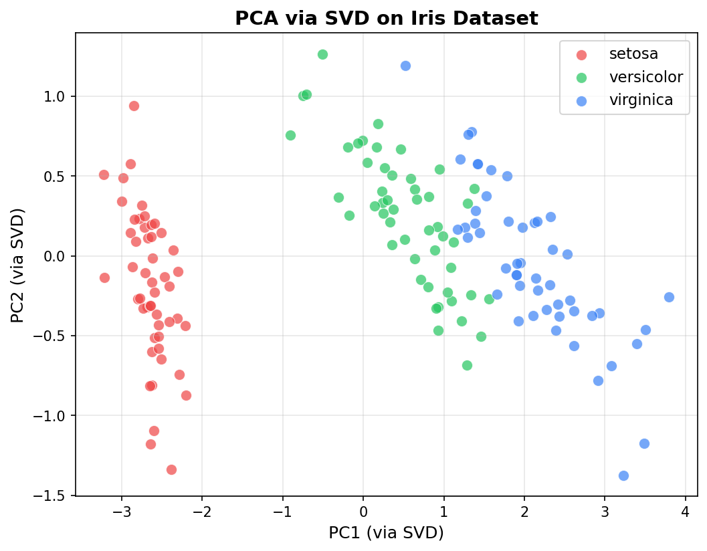

### NumPy: Economy SVD

```python
# Economy SVD (reduced form, more memory efficient)
U, s, Vt = np.linalg.svd(X, full_matrices=False)

print(f"U shape:  {U.shape}")    # (3, 2) — reduced!
print(f"s: {s}")                  # [5. 3.]
print(f"Vt shape: {Vt.shape}")  # (2, 2)

# Reconstruct — simpler since shapes match
X_reconstructed = U * s @ Vt   # broadcasting trick
```

### scikit-learn: PCA (uses SVD internally)

```python
from sklearn.decomposition import PCA

# PCA uses SVD under the hood (NOT eigen decomposition)
pca = PCA(n_components=2, svd_solver='full')  # Options: 'auto', 'full', 'arpack', 'randomized'
X_reduced = pca.fit_transform(X)

print(f"Explained variance ratio: {pca.explained_variance_ratio_}")
print(f"Singular values: {pca.singular_values_}")
print(f"Components (V): {pca.components_}")  # Right singular vectors = PC directions
```

### scikit-learn: TruncatedSVD (for sparse data)

```python
from sklearn.decomposition import TruncatedSVD

# TruncatedSVD — works directly on data (no centering), great for sparse matrices
svd = TruncatedSVD(n_components=2, algorithm='randomized', random_state=42)
X_reduced = svd.fit_transform(X)

print(f"Explained variance ratio: {svd.explained_variance_ratio_}")
print(f"Singular values: {svd.singular_values_}")
print(f"Components: {svd.components_}")
```

### PCA svd_solver Options in sklearn

| `svd_solver` | Algorithm | Best For | Time Complexity |
|---|---|---|---|
| `'auto'` | Auto selects based on data shape | Default, usually fine | Varies |
| `'full'` | Full SVD via LAPACK | Small to medium datasets | $O(\min(n^2d, nd^2))$ |
| `'arpack'` | Truncated SVD via ARPACK (iterative) | Large sparse matrices, few components | $O(nd \cdot k)$ |
| `'randomized'` | Randomized SVD (Halko et al. 2009) | **Large datasets, few components** | $O(nd \cdot k)$ |

```python
# For large datasets with few components — randomized is fastest
pca = PCA(n_components=50, svd_solver='randomized', random_state=42)
X_reduced = pca.fit_transform(X_large)  # X_large could be 100000 × 5000
```

> **When to use what:**
> - `PCA` → standard use (centers data, computes variance)
> - `TruncatedSVD` → sparse matrices (TF-IDF, count matrices), LSA
> - `np.linalg.svd` → manual control, custom implementations

### Image Compression Example

```python
import numpy as np
import matplotlib.pyplot as plt
from sklearn.datasets import load_sample_image

# Load image (convert to grayscale)
image = plt.imread('image.jpg')
gray = np.mean(image, axis=2)  # Convert to grayscale

# SVD on the image
U, s, Vt = np.linalg.svd(gray, full_matrices=False)

# Reconstruct with different ranks
fig, axes = plt.subplots(1, 4, figsize=(20, 5))

for idx, k in enumerate([5, 20, 50, min(gray.shape)]):
    # Truncated reconstruction
    reconstruction = (U[:, :k] * s[:k]) @ Vt[:k, :]
    axes[idx].imshow(reconstruction, cmap='gray')
    
    # Calculate compression ratio
    original_size = gray.shape[0] * gray.shape[1]
    compressed_size = k * (gray.shape[0] + gray.shape[1] + 1)
    ratio = compressed_size / original_size * 100
    
    axes[idx].set_title(f'Rank {k}\n({ratio:.1f}% storage)')
    axes[idx].axis('off')

plt.suptitle('SVD Image Compression', fontsize=16)
plt.tight_layout()
plt.show()

# Scree plot — explained variance
explained = (s ** 2) / np.sum(s ** 2)
cumulative = np.cumsum(explained)

plt.figure(figsize=(10, 4))
plt.subplot(1, 2, 1)
plt.plot(explained[:50], 'bo-', markersize=3)
plt.xlabel('Component')
plt.ylabel('Explained Variance Ratio')
plt.title('Scree Plot (first 50 components)')

plt.subplot(1, 2, 2)
plt.plot(cumulative[:50], 'ro-', markersize=3)
plt.axhline(y=0.95, color='k', linestyle='--', label='95% threshold')
plt.xlabel('Number of Components')
plt.ylabel('Cumulative Explained Variance')
plt.title('Cumulative Variance')
plt.legend()
plt.tight_layout()
plt.show()
```

### From-Scratch SVD-Based PCA

```python
import numpy as np

def pca_via_svd(X, n_components):
    """PCA using SVD — the way sklearn does it"""
    # 1. Center the data
    mean = X.mean(axis=0)
    X_centered = X - mean
    
    # 2. SVD (economy form)
    U, s, Vt = np.linalg.svd(X_centered, full_matrices=False)
    
    # 3. Select top-k components
    components = Vt[:n_components]          # (k, d) — PC directions
    singular_values = s[:n_components]      # (k,)
    
    # 4. Project data
    X_reduced = X_centered @ components.T   # (n, k)
    
    # 5. Explained variance
    explained_variance = (s ** 2) / (X.shape[0] - 1)
    explained_variance_ratio = explained_variance / explained_variance.sum()
    
    return {
        'X_reduced': X_reduced,
        'components': components,
        'singular_values': singular_values,
        'explained_variance': explained_variance[:n_components],
        'explained_variance_ratio': explained_variance_ratio[:n_components],
        'mean': mean
    }

# Usage
from sklearn.datasets import load_iris
X = load_iris().data

result = pca_via_svd(X, n_components=2)
print(f"Explained variance ratio: {result['explained_variance_ratio']}")
# Output: [0.9246, 0.0531] — first 2 PCs capture ~97.8% of variance
```

---

## 9. SVD vs Eigen Decomposition — When to Use Which

| Criterion | Eigen Decomposition | SVD |
|---|---|---|
| **Input shape** | Square only ($n \times n$) | **Any** ($m \times n$) |
| **Existence** | Not always (needs diagonalizability) | **Always exists** |
| **Values** | Eigenvalues (can be negative, complex) | Singular values (**always $\geq 0$, real**) |
| **Numerical stability** | Less stable (forming $A^TA$ squares condition number) | **More stable** (avoids squaring) |
| **PCA: operates on** | Covariance matrix $\Sigma$ ($d \times d$) | Data matrix $X$ ($n \times d$) directly |
| **PCA: better when** | $d$ is small | $n$ or $d$ is large, or data is ill-conditioned |
| **Vectors** | Eigenvectors (may not be orthogonal) | Left & right singular vectors (**always orthogonal**) |
| **Implementations** | `np.linalg.eig`, `np.linalg.eigh` | `np.linalg.svd`, `sklearn PCA` |
| **Speed** | Faster when $d \ll n$ (small covariance matrix) | Faster with randomized methods for large matrices |

### Connection Between Singular Values and Eigenvalues

| Matrix | Eigen Decomposition | SVD |
|---|---|---|
| $A^TA$ | eigenvalues = $\lambda_i$ | singular values² = $\sigma_i^2 = \lambda_i$ |
| $AA^T$ | eigenvalues = $\lambda_i$ | singular values² = $\sigma_i^2 = \lambda_i$ |
| Covariance $\Sigma$ | eigenvalues = $\lambda_i$ (from $\Sigma = V\Lambda V^T$) | $\sigma_i^2 / (n-1) = \lambda_i$ (from $X = U\Sigma V^T$) |

### Decision Guide

- **Rectangular matrix?** → Use SVD (only option)
- **Square, symmetric matrix?** → Use either Eigen or SVD
- **Square, non-symmetric?** → Use SVD (more stable)
- **General rule:** When in doubt, use SVD — it always works and is more numerically stable

---

## 10. Key Properties & Theorems

### Fundamental Properties

| Property | Formula / Statement |
|---|---|
| **Rank** | $\text{rank}(A) = $ number of non-zero singular values |
| **Frobenius norm** | $\lVert A \rVert_F = \sqrt{\sum \sigma_i^2}$ |
| **Spectral norm (2-norm)** | $\lVert A \rVert_2 = \sigma_1$ (largest singular value) |
| **Condition number** | $\kappa(A) = \sigma_1 / \sigma_r$ (ratio of largest to smallest non-zero) |
| **Determinant** (square $A$) | $\lvert\det(A)\rvert = \prod \sigma_i$ |
| **Trace** | $\text{tr}(A^TA) = \sum \sigma_i^2$ |

### Eckart–Young–Mirsky Theorem

$$
\boxed{A_k = \arg\min_{\text{rank}(B)=k} \lVert A - B \rVert}
$$

The truncated SVD is the **optimal** low-rank approximation in both:
- Frobenius norm: $\lVert A - A_k \rVert_F^2 = \sigma_{k+1}^2 + \cdots + \sigma_r^2$
- Spectral norm: $\lVert A - A_k \rVert_2 = \sigma_{k+1}$

### The Four Fundamental Subspaces (via SVD)

SVD reveals the complete structure of a matrix's four fundamental subspaces:

- **Column space** of $A$ = span of first $r$ columns of $U$
- **Left null space** of $A$ = span of remaining $(m-r)$ columns of $U$
- **Row space** of $A$ = span of first $r$ columns of $V$
- **Null space** of $A$ = span of remaining $(n-r)$ columns of $V$

where $r = \text{rank}(A) = $ number of non-zero singular values.

### Quick Reference: SVD Cheat Sheet

| Item | Details |
|---|---|
| **Formula** | $A = U\Sigma V^T$ |
| **U** $(m \times m)$ | Left singular vectors, orthogonal. Columns = eigenvectors of $AA^T$ |
| **$\Sigma$** $(m \times n)$ | Singular values on diagonal, $\sigma_1 \geq \sigma_2 \geq \cdots \geq 0$. $\sigma_i = \sqrt{\text{eigenvalue of } A^TA}$ |
| **$V^T$** $(n \times n)$ | Right singular vectors, orthogonal. Rows = eigenvectors of $A^TA$ |
| **PCA connection** | PC directions = columns of $V$ (= rows of $V^T$). Variance per PC = $\sigma_i^2 / (n-1)$ |
| **sklearn PCA** | Internally calls SVD, not eigen decomposition |
| **Best rank-k** | $A_k = U_k \Sigma_k V_k^T$ (Eckart-Young theorem) |
| **numpy** | `U, s, Vt = np.linalg.svd(A)` |
| **sklearn** | `PCA(n_components=k).fit_transform(X)` |
| **sparse** | `TruncatedSVD(n_components=k).fit_transform(X)` |

---

> **Prerequisites:** [Linear Algebra for PCA](references/linear-algebra-for-pca.md) (eigen decomposition, special matrices) → [PCA Theory](02-pca.ipynb) → [PCA Implementation](03-pca-implementation.ipynb) → this note.
>
> **Related:** [Kernel PCA](04-kernel-pca.md) — when linear PCA (and SVD) can't capture non-linear structure.
>
> **Next steps:** Implement SVD-based image compression from scratch, or explore `TruncatedSVD` for text/NLP tasks.
