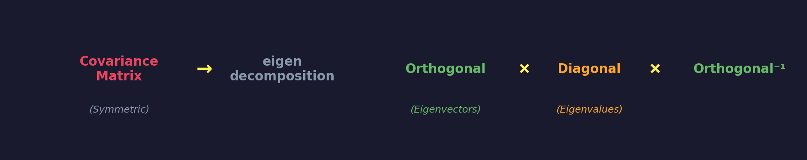
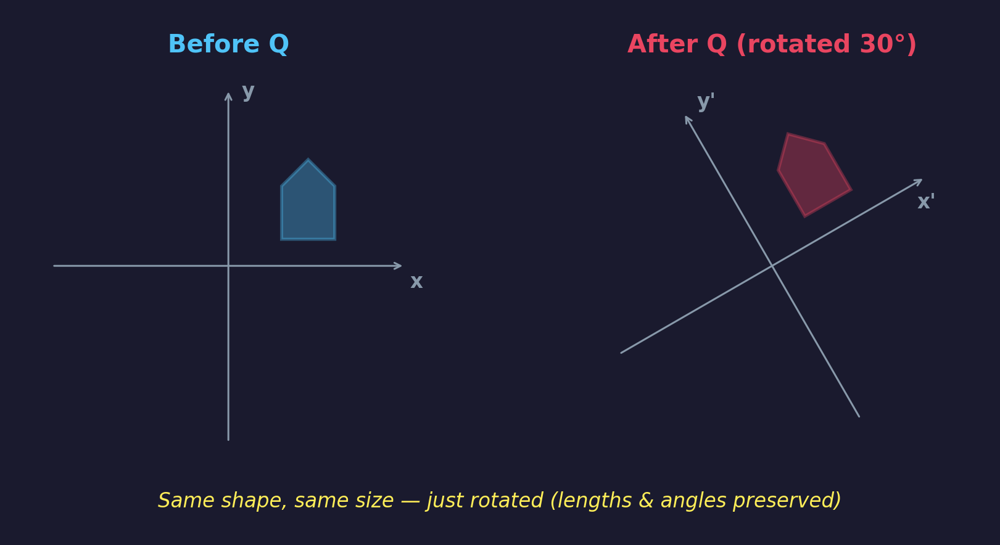
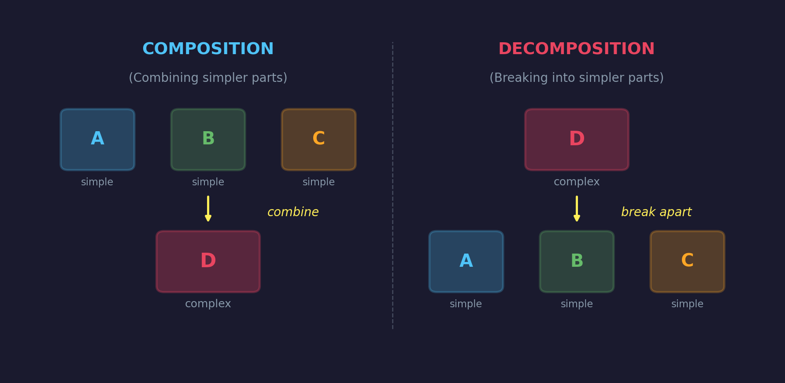
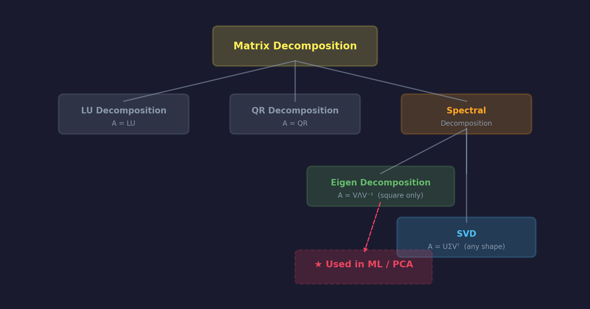
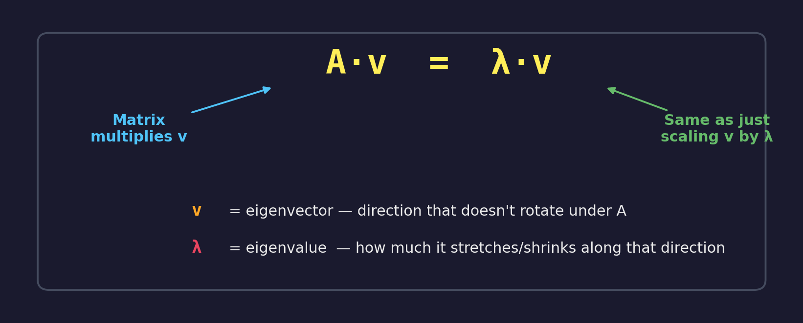
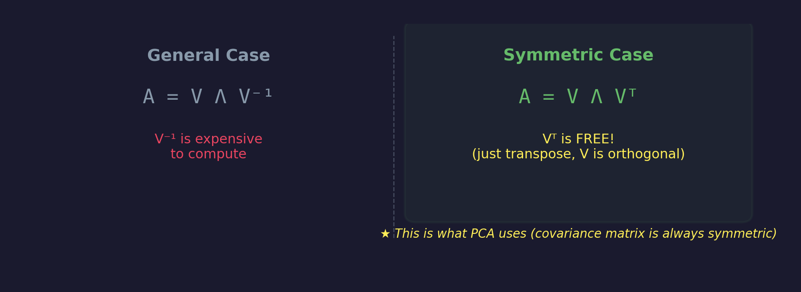
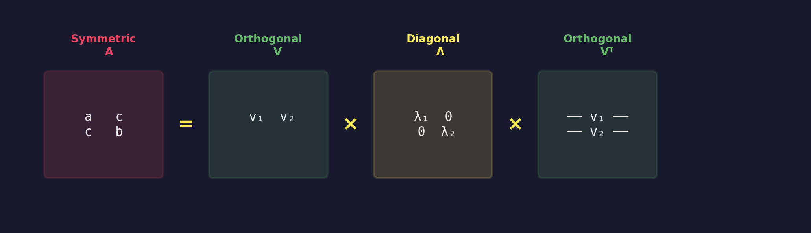
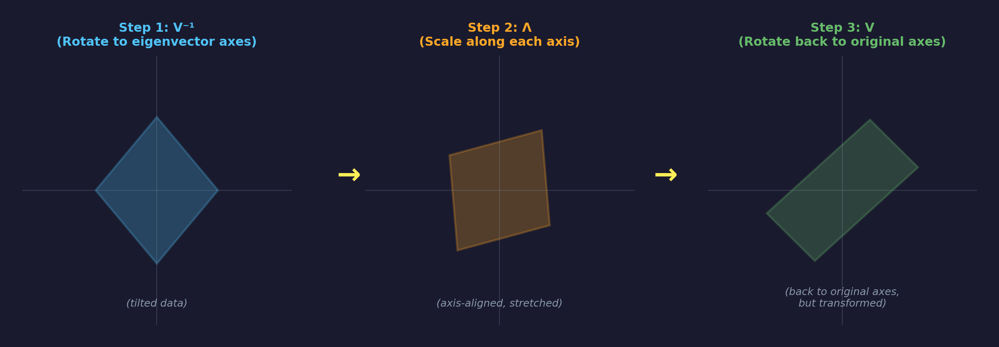
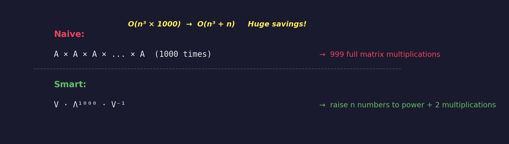
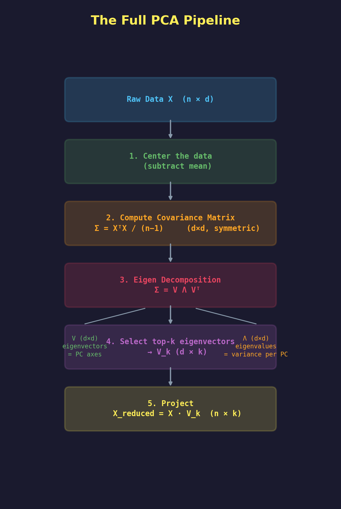

# Linear Algebra Foundations for PCA

> **Roadmap:** This reference covers the mathematical building blocks you need before understanding PCA's internals — from special matrix types through matrix decomposition to the full eigen decomposition pipeline.

---

## Table of Contents

1. [Special Matrices](#1-special-matrices)
   - [Diagonal Matrix](#11-diagonal-matrix)
   - [Orthogonal Matrix](#12-orthogonal-matrix)
   - [Symmetric Matrix](#13-symmetric-matrix)
2. [Matrix Composition & Decomposition](#2-matrix-composition--decomposition)
3. [Types of Matrix Decomposition](#3-types-of-matrix-decomposition)
4. [Eigen Decomposition — Deep Dive](#4-eigen-decomposition--deep-dive)
5. [Spectral Decomposition (Symmetric Case)](#5-spectral-decomposition-symmetric-case)
6. [Geometric Interpretation — Rotate, Scale, Rotate Back](#6-geometric-interpretation--rotate-scale-rotate-back)
7. [Advantages of Eigen Decomposition](#7-advantages-of-eigen-decomposition)
8. [Quick Reference Tables](#8-quick-reference-tables)

---

## 1. Special Matrices

These three matrix types are the **building blocks** of eigen decomposition. Every time PCA decomposes a covariance matrix, it produces exactly these:

---

### 1.1 Diagonal Matrix

A diagonal matrix is a **square matrix** where all entries outside the main diagonal are zero.

$$
D = \begin{bmatrix} a & 0 & 0 \\ 0 & b & 0 \\ 0 & 0 & c \end{bmatrix}
$$

#### Key Properties

| Property | Description | Example |
|---|---|---|
| **Powers** | $D^n$ = raise each diagonal element to the $n$-th power | $\begin{bmatrix} 5 & 0 \\ 0 & 6 \end{bmatrix}^{100} = \begin{bmatrix} 5^{100} & 0 \\ 0 & 6^{100} \end{bmatrix}$ |
| **Eigenvalues** | Simply the values on the diagonal | $\lambda_1 = a,\; \lambda_2 = b$ |
| **Eigenvectors** | The **standard basis vectors** | $e_1 = \begin{bmatrix} 1 \\ 0 \end{bmatrix},\; e_2 = \begin{bmatrix} 0 \\ 1 \end{bmatrix}$ |
| **Vector Multiplication** | Scales each component independently | $\begin{bmatrix} a & 0 \\ 0 & b \end{bmatrix} \begin{bmatrix} x \\ y \end{bmatrix} = \begin{bmatrix} ax \\ by \end{bmatrix}$ |
| **Matrix × Matrix** | Diagonal × Diagonal = Diagonal (element-wise) | $\begin{bmatrix} a & 0 \\ 0 & b \end{bmatrix} \begin{bmatrix} c & 0 \\ 0 & d \end{bmatrix} = \begin{bmatrix} ac & 0 \\ 0 & bd \end{bmatrix}$ |

#### Intuition

> Think of a diagonal matrix as a set of **independent volume knobs** — each one controls one axis without touching the others. This is what makes diagonal matrices computationally cheap.

#### Role in PCA

In eigen decomposition $A = V\Lambda V^{-1}$, the $\Lambda$ is a **diagonal matrix of eigenvalues**. Each eigenvalue tells you how much variance that principal component captures.

---

### 1.2 Orthogonal Matrix

A square matrix whose columns (and rows) are **orthonormal vectors** — all of **unit length** and **mutually perpendicular**.

$$
Q^T = Q^{-1} \quad \Longleftrightarrow \quad Q^T Q = I
$$

> **Geometric Interpretation:** An orthogonal matrix = **pure rotation** (or reflection). No scaling, no shearing, no distortion.

#### Column Conditions (2×2)

For $Q = \begin{bmatrix} a & b \\ c & d \end{bmatrix}$:

| Condition | Meaning |
|---|---|
| $ab + cd = 0$ | Columns are **perpendicular** (dot product = 0) |
| $\sqrt{a^2 + c^2} = 1$ | First column has **unit length** |
| $\sqrt{b^2 + d^2} = 1$ | Second column has **unit length** |

#### Key Properties

| Property | Description |
|---|---|
| **Inverse = Transpose** | $Q^{-1} = Q^T$ — makes computation extremely cheap |
| **Preserves lengths** | $\lVert Qx \rVert = \lVert x \rVert$ — distances stay the same |
| **Preserves angles** | The angle between vectors is unchanged |
| **Determinant** | $\det(Q) = \pm 1$ (+1 = rotation, −1 = reflection) |

#### Example: 2D Rotation Matrix

$$
R(\theta) = \begin{bmatrix} \cos\theta & \sin\theta \\ -\sin\theta & \cos\theta \end{bmatrix}
$$

**Verification for $\theta = 30°$:**

$$
R(30°) = \begin{bmatrix} \frac{\sqrt{3}}{2} & \frac{1}{2} \\[4pt] -\frac{1}{2} & \frac{\sqrt{3}}{2} \end{bmatrix}
$$

- Orthogonality: $\frac{\sqrt{3}}{2} \cdot \frac{1}{2} - \frac{1}{2} \cdot \frac{\sqrt{3}}{2} = 0$ ✓
- Unit length: $\sqrt{\frac{3}{4} + \frac{1}{4}} = 1$ ✓

> **Special case:** Identity matrix $I$ is orthogonal — it's rotation by $0°$.

#### Role in PCA

The eigenvector matrix $V$ in the decomposition of the covariance matrix is **orthogonal**. This guarantees principal components are **perpendicular** — they capture **independent, uncorrelated** directions of variance.

---

### 1.3 Symmetric Matrix

A square matrix equal to its own transpose:

$$
A = A^T
$$

$$
\begin{bmatrix} a & c \\ c & b \end{bmatrix}^T = \begin{bmatrix} a & c \\ c & b \end{bmatrix} \quad \text{(same matrix!)}
$$

#### Key Properties

| Property | Description |
|---|---|
| **Real Eigenvalues** | Always real numbers (never complex) — critical for interpretability |
| **Orthogonal Eigenvectors** | Eigenvectors for different eigenvalues are automatically perpendicular |
| **Orthonormal Basis** | Distinct eigenvalues → orthonormal eigenvector basis |
| **Always Diagonalizable** | Can always be decomposed as $A = Q\Lambda Q^T$ |

#### Role in PCA

The **covariance matrix** is always symmetric because $\text{Cov}(x,y) = \text{Cov}(y,x)$:

$$
\Sigma = \begin{bmatrix} \text{Var}(x_1) & \text{Cov}(x_1, x_2) \\ \text{Cov}(x_2, x_1) & \text{Var}(x_2) \end{bmatrix}
$$

This symmetry **guarantees** all the nice properties PCA relies on:
1. Real eigenvalues → variance explained is a real positive number
2. Orthogonal eigenvectors → uncorrelated principal components
3. Clean decomposition → $\Sigma = Q\Lambda Q^T$

---

## 2. Matrix Composition & Decomposition

Two complementary perspectives on complex transformations:

### Matrix Composition

Multiplying matrices together = **composing transformations**:

$$
\begin{bmatrix} a & b \\ c & d \end{bmatrix} \begin{bmatrix} e & f \\ g & h \end{bmatrix} = \begin{bmatrix} k & l \\ m & n \end{bmatrix}
$$

Each matrix is a transformation (rotate, scale, shear, etc.). Multiplying them creates a **single combined transformation** $D = ABC$.

> **Key insight:** Composition combines multiple simple operations into one complex operation. Decomposition does the reverse.

### Matrix Decomposition

Breaking a complex matrix into a product of simpler, structured matrices:

$$
D = A \cdot B \cdot C \quad \text{(decomposition)}
$$

**Why decompose?**
- Simpler matrices → faster computation
- Reveals underlying structure (rotations, scalings)
- Enables efficient algorithms (solving systems, computing powers, etc.)

---

## 3. Types of Matrix Decomposition

| Decomposition | Formula | When to Use | Constraint |
|---|---|---|---|
| **LU** | $A = LU$ | Solving linear systems, inverting matrices | Square matrix |
| **QR** | $A = QR$ | Least squares, numerical stability | Any matrix |
| **Eigen** | $A = V\Lambda V^{-1}$ | PCA, spectral analysis, matrix powers | Square + diagonalizable |
| **SVD** | $A = U\Sigma V^T$ | PCA (general), recommender systems, compression | **Any** matrix (most general) |

> **For PCA:** Eigen decomposition works because the covariance matrix is always square and symmetric. SVD is more general and works even on the raw data matrix directly.

---

## 4. Eigen Decomposition — Deep Dive

### The Core Equation

For a square matrix $A$, we seek vectors $\vec{v}$ and scalars $\lambda$ such that:

$$
\boxed{A\vec{v} = \lambda\vec{v}}
$$

- $\vec{v}$ — **eigenvector** (direction that doesn't rotate under $A$)
- $\lambda$ — **eigenvalue** (how much it stretches/shrinks along that direction)

### The Decomposition

If $A$ is an $n \times n$ matrix with $n$ linearly independent eigenvectors:

$$
\boxed{A = V \Lambda V^{-1}}
$$

Where:
- $V = \begin{bmatrix} \vec{v}_1 & \vec{v}_2 & \cdots & \vec{v}_n \end{bmatrix}$ — columns are eigenvectors
- $\Lambda = \begin{bmatrix} \lambda_1 & 0 & \cdots \\ 0 & \lambda_2 & \cdots \\ \vdots & & \ddots \end{bmatrix}$ — diagonal matrix of eigenvalues
- $V^{-1}$ — inverse of the eigenvector matrix

### How It's Constructed (2×2 Example)

Given $A = \begin{bmatrix} a & b \\ c & d \end{bmatrix}$ with eigenvalues $\lambda_1, \lambda_2$ and eigenvectors $\vec{v}_1 = \begin{bmatrix} x_1 \\ y_1 \end{bmatrix}$, $\vec{v}_2 = \begin{bmatrix} x_2 \\ y_2 \end{bmatrix}$:

$$
\underbrace{\begin{bmatrix} a & b \\ c & d \end{bmatrix}}_{A} = \underbrace{\begin{bmatrix} x_1 & x_2 \\ y_1 & y_2 \end{bmatrix}}_{V} \underbrace{\begin{bmatrix} \lambda_1 & 0 \\ 0 & \lambda_2 \end{bmatrix}}_{\Lambda} \underbrace{\begin{bmatrix} x_1 & x_2 \\ y_1 & y_2 \end{bmatrix}^{-1}}_{V^{-1}}
$$

This works because $A$ satisfies both eigenvalue equations simultaneously:

$$
A\vec{v}_1 = \lambda_1 \vec{v}_1 \quad \text{and} \quad A\vec{v}_2 = \lambda_2 \vec{v}_2
$$

### Requirements

| Requirement | Explanation |
|---|---|
| **Square matrix** | Eigen decomposition is only defined for $n \times n$ matrices |
| **Diagonalizable** | Must have $n$ **linearly independent** eigenvectors (a 2×2 needs 2 eigenvectors, 3×3 needs 3, etc.) |

> **Not all square matrices are diagonalizable.** Example: $\begin{bmatrix} 1 & 1 \\ 0 & 1 \end{bmatrix}$ (a shear matrix) has only one linearly independent eigenvector — it **cannot** be eigen-decomposed.

---

## 5. Spectral Decomposition (Symmetric Case)

When $A$ is **symmetric** ($A = A^T$), eigen decomposition becomes especially clean:

$$
\boxed{A = V \Lambda V^{T}} \quad \text{(Spectral Decomposition)}
$$

### Why It's Special

| Component | General Eigen Decomposition | Symmetric (Spectral) |
|---|---|---|
| $V$ | Any invertible matrix | **Orthogonal** matrix ($V^T = V^{-1}$) |
| $\Lambda$ | Diagonal (may be complex) | Diagonal with **real** entries |
| Inverse | Need to compute $V^{-1}$ explicitly | Just use $V^T$ (free!) |

### Connection to All Three Matrix Types

This is the beautiful payoff — the spectral theorem connects everything:

$$
\underbrace{A}_{\text{Symmetric}} = \underbrace{V}_{\text{Orthogonal}} \cdot \underbrace{\Lambda}_{\text{Diagonal}} \cdot \underbrace{V^T}_{\text{Orthogonal}}
$$

### Why PCA Uses This

The covariance matrix $\Sigma$ is:
- **Always symmetric** (because $\text{Cov}(x,y) = \text{Cov}(y,x)$)
- **Always positive semi-definite** (eigenvalues $\geq 0$)

So we get the **cleanest possible** decomposition:

$$
\Sigma = V \Lambda V^T
$$

With:
- $V$ columns = **principal component directions** (orthogonal)
- $\Lambda$ diagonal = **variance captured** by each PC (real, non-negative)

---

## 6. Geometric Interpretation — Rotate, Scale, Rotate Back

The eigen decomposition $A = V\Lambda V^{-1}$ has an elegant geometric meaning:

$$
A\vec{x} = V \cdot \Lambda \cdot V^{-1} \vec{x}
$$

Reading **right to left**, three sequential operations:

| Step | Operation | Matrix | What it does |
|---|---|---|---|
| 1 | **Rotate** into eigenvector coordinate system | $V^{-1}$ (or $V^T$ if symmetric) | Aligns data with eigenvector axes |
| 2 | **Scale** along each eigenvector axis | $\Lambda$ | Stretches/shrinks by eigenvalues |
| 3 | **Rotate back** to original coordinate system | $V$ | Returns to the original orientation |

> **Intuition for symmetric matrices:** Any linear transformation by a symmetric matrix is equivalent to: (1) rotating to find the "natural" axes, (2) stretching along those axes, (3) rotating back. PCA finds exactly those natural axes.

---

## 7. Advantages of Eigen Decomposition

### 7.1 Efficient Matrix Powers

Computing $A^{1000}$ naively requires 999 matrix multiplications. With eigen decomposition:

$$
A^n = V \Lambda^n V^{-1}
$$

Since $\Lambda$ is diagonal:

$$
\Lambda^n = \begin{bmatrix} \lambda_1^n & 0 \\ 0 & \lambda_2^n \end{bmatrix}
$$

### 7.2 Diagonalization = Simplification

A complex matrix $A$ is replaced by a simple diagonal $\Lambda$:

$$
\begin{bmatrix} a & b \\ c & d \end{bmatrix} \xrightarrow{\text{diagonalize}} \begin{bmatrix} \lambda_1 & 0 \\ 0 & \lambda_2 \end{bmatrix}
$$

All the "cross-terms" disappear. Each dimension becomes independent.

### 7.3 Applications Across Fields

| Field | Use of Eigen Decomposition |
|---|---|
| **Machine Learning / PCA** | Find principal directions of variance in data |
| **Physics** | Normal modes of vibration, quantum mechanics (Hamiltonians) |
| **Signal Processing** | Decompose signals into frequency components |
| **Quantum Mechanics** | Observable quantities are eigenvalues of Hermitian operators |
| **Graph Theory** | Spectral clustering, PageRank |
| **Differential Equations** | Solve systems of linear ODEs via diagonalization |

### 7.4 Useful Facts

| Fact | Formula |
|---|---|
| Product of eigenvalues = determinant | $\det(A) = \prod \lambda_i$ |
| Sum of eigenvalues = trace | $\text{tr}(A) = \sum \lambda_i$ |
| Eigenvalues of $A^{-1}$ | $\lambda_i^{-1}$ (reciprocals) |
| Eigenvalues of $A^n$ | $\lambda_i^n$ |
| Eigenvectors of $A$ and $A^{-1}$ | **Same** eigenvectors |

---

## 8. Quick Reference Tables

### Special Matrices at a Glance

| Property | Diagonal | Orthogonal | Symmetric |
|---|---|---|---|
| **Definition** | Off-diagonal = 0 | $Q^T = Q^{-1}$ | $A = A^T$ |
| **Eigenvalues** | Diagonal entries | $\lvert\lambda\rvert = 1$ | Always real |
| **Eigenvectors** | Standard basis | — | Always orthogonal |
| **Geometric effect** | Scaling only | Rotation only | Scaling along orthogonal axes |
| **Key benefit** | $D^n$ is trivial | Cheap inverse ($= Q^T$) | Spectral decomposition |

### Decomposition Comparison

| | Eigen Decomposition | SVD |
|---|---|---|
| **Formula** | $A = V\Lambda V^{-1}$ | $A = U\Sigma V^T$ |
| **Input** | Square matrix only | **Any** matrix ($m \times n$) |
| **Requirement** | Diagonalizable | Always exists |
| **Diagonal part** | Eigenvalues (can be negative) | Singular values (always $\geq 0$) |
| **PCA usage** | On the covariance matrix $\Sigma$ | Directly on the data matrix $X$ |

### The Full PCA Pipeline

---

> **Next:** See [PCA Theory](../02-pca.ipynb) for the full PCA walkthrough, or [PCA Implementation](../03-pca-implementation.ipynb) to code it from scratch.
>
> **Prerequisite for this:** [Curse of Dimensionality](../01-curse-of-dimensionality.md) — why we need dimensionality reduction in the first place.
